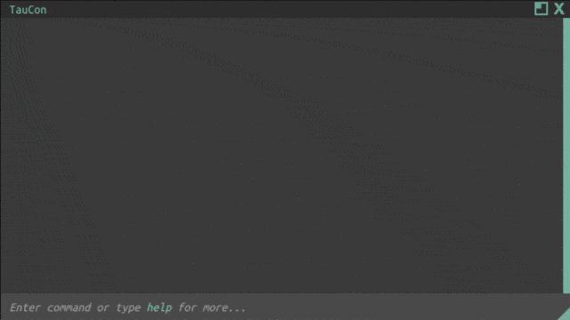

I no longer use Unity due to their runtime fee nonsense. Unity has recently dropped their runtime fee and walked back other changes however if you are interested; https://unity.com/blog/unity-is-canceling-the-runtime-fee

Personally, I don't see myself using Unity again. Godot is an amazing open-source alternative however: https://godotengine.org/

---

  

## Features:

- Input & parsing
- Predefined primary & secondary themes!
- C o l o u r e d logging (modifiable per log type!)
- Command history and bash-like history navigation (up-down arrow keys)
- Dragging & resizing of console
- Position reset button (top-left corner)
- Custom fonts
- Custom font sizes
- Default commands:
  - help
  - clear
  - exit
  - quit
  - volume
- Many, many in-editor options like:
  - Custom prompt symbol
  - Choose from predefined themes
  - Or make your own!
  - Max output length (this is per log, not per character)
  - Tab focus
  - Clear on submit
  - Reselect on submit
  - Output Unity log
  - Output stack trace
  - Allow empty output
  - Newline on output
  - Input character limit
  - Custom caret colour
  - Caret blink rate
  - Caret width (10 is a nice block)
  - Console 'version' text (the text at the top of the console)

  

## Planned:

- Comments, comments everywhere
- Docs in the comments
- Comments in the docs
- Cleaning

# How to add commands

1. Duplicate "CommandTemplate.cs"
2. Modify the filename and the classname to reflect the command being created
3. Modify the code within. I've added comments that clearly state how to add a command, and looking at the AddCommand function in `TauCon.cs` should give more indication of what is required to register a command
4. As far as code goes, it's going to be unique to every project, which is why I included only the most basic of commands
5. Have fun! If you find a bug or have a cleaner way of doing something hit me up or submit a PR (Please keep in mind this was my first major completed project with C#/Unity, be nice 😅)

---

  

